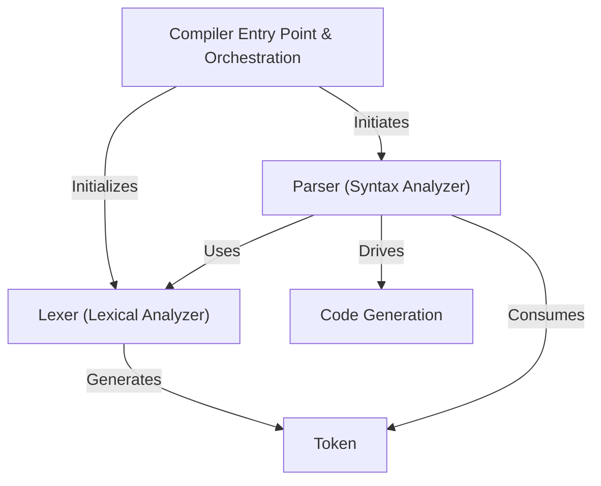
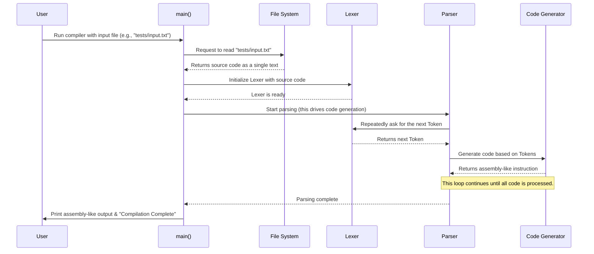
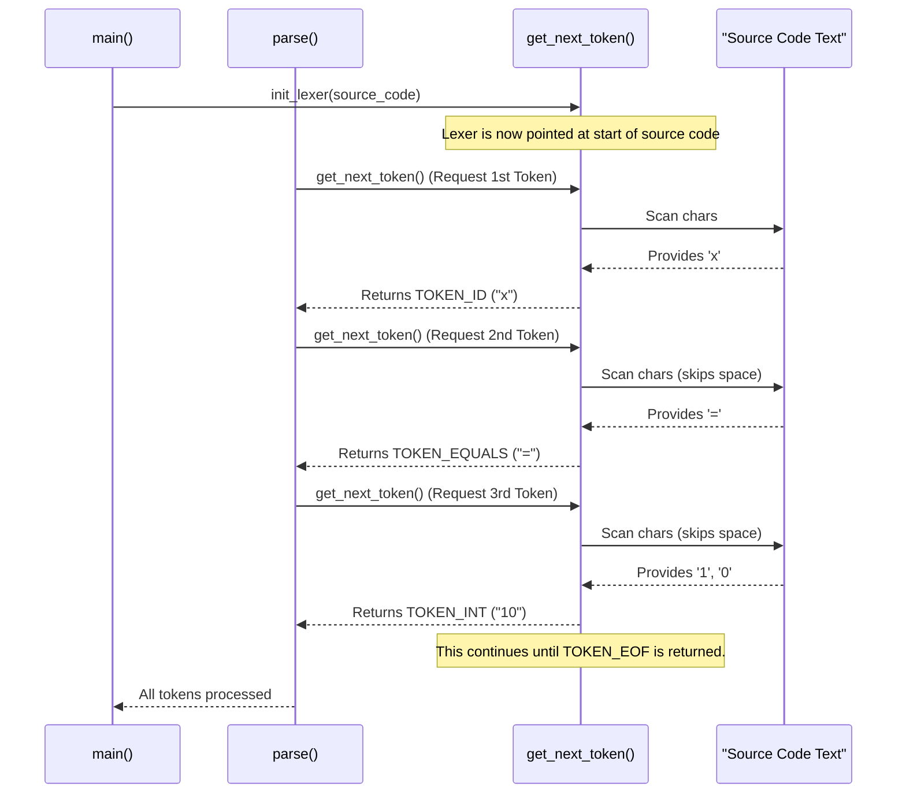

# Tutorial: nano-c

This project, `nano-c`, is a **simple C compiler** designed for _educational purposes_.
It takes raw source code as input, first breaking it down into meaningful _Tokens_ (like words),
then checking if these tokens form valid _grammar statements_. Finally, it translates these statements
into _Assembly-like instructions_ which are printed to the console.

## Visual Overview



## Chapters

1. [Compiler Entry Point & Orchestration
   ](01_compiler_entry_point___orchestration_.md)
2. [Parser (Syntax Analyzer)
   ](02_parser__syntax_analyzer__.md)
3. [Token
   ](03_token_.md)
4. [Lexer (Lexical Analyzer)
   ](04_lexer__lexical_analyzer__.md)
5. [Code Generation
   ](05_code_generation_.md)

# Chapter 1: Compiler Entry Point & Orchestration

Welcome to the exciting world of compilers! In this first chapter, we're going to explore the "control center" of our `nano-c` compiler: the Compiler Entry Point. Think of it as the project manager that coordinates all the different teams (like the Lexer and Parser) to build our final product.

### What is the "Compiler Entry Point"?

Imagine you have a big project, like building a house. You don't just start hammering nails randomly! You need a main person, a project manager, who:

1.  Receives the building plans (the input).
2.  Gets the site ready.
3.  Assigns tasks to different teams (e.g., plumbing, electrical, framing).
4.  Ensures everything happens in the correct order.
5.  Handles any immediate problems, like not having enough materials.

In our `nano-c` compiler, the "Compiler Entry Point & Orchestration" is exactly that project manager. It's the starting point of our program, the `main` function in `src/main.c`, and it's responsible for making sure the entire compilation process runs smoothly from start to finish.

### Why Do We Need It?

Our goal is to take a `.txt` file containing some simple "C-like" code and turn it into "assembly-like" instructions. This is a complex task that involves several steps:

- Reading the code from the file.
- Breaking the code into meaningful pieces (tokens).
- Understanding the structure of the code (syntax).
- Generating the final instructions.

Without a central "project manager" to orchestrate these steps, our compiler would be a chaotic mess! The entry point ensures each part of the compiler does its job at the right time.

### How to Use Our Compiler

Before we dive into the code, let's see our compiler in action. First, you need to build it using the `Makefile`.

```bash
make
```

This command uses the instructions in the `Makefile` to compile all our `.c` files (like `src/main.c`, `src/lexer.c`, etc.) and create an executable file named `compiler` inside the `bin/` folder.

Once built, you can run the compiler and tell it which source code file to compile. Our `README.md` shows us how:

```bash
./bin/compiler tests/input.txt
```

In this command:

- `./bin/compiler` is our compiled "project manager" program.
- `tests/input.txt` is the "building plan" (our source code file) that we want the compiler to process.

When you run this, our compiler's entry point will take over! It will read `tests/input.txt`, process it, and print some "Assembly-like" instructions to your console.

### The Orchestration Process: A High-Level View

Let's visualize how our compiler entry point coordinates the different parts.



As you can see, the `main()` function in `MainFunc` is the central point. It gets the input, sets up the [Lexer (Lexical Analyzer)](04_lexer__lexical_analyzer__.md), and then tells the [Parser (Syntax Analyzer)](02_parser__syntax_analyzer__.md) to start its work. The Parser then works closely with the Lexer and [Code Generation](05_code_generation_.md) to produce the final output.

### Diving into the Code (`src/main.c`)

Let's look at the heart of our compiler's entry point: the `main` function in `src/main.c`.

#### 1. The `main` Function and Command-Line Arguments

Every C program starts its execution in the `main` function. It's the very first piece of our compiler that runs.

```c
// src/main.c
// ... includes and read_file function ...

int main(int argc, char *argv[])
{
    if (argc < 2)
    {
        printf("Usage: %s <input_file>\n", argv[0]);
        return 1;
    }

    printf("--- Simple Compiler ---\n");
    printf("Compiling file: %s\n\n", argv[1]);

    // ... rest of the main function ...
}
```

- `int main(int argc, char *argv[])`: This is the standard way to define the `main` function.
  - `argc` (argument count) tells us how many command-line arguments were provided. For `./bin/compiler tests/input.txt`, `argc` would be 2 (`./bin/compiler` is the first argument, `tests/input.txt` is the second).
  - `argv` (argument vector) is an array of strings, where each string is one of the command-line arguments. So, `argv[0]` is `./bin/compiler`, and `argv[1]` is `tests/input.txt`.
- `if (argc < 2)`: This check ensures that the user provided an input file. If they just type `./bin/compiler` without a file, it will print a "Usage" message and exit. This is basic error handling.
- The `printf` statements are just friendly messages to show the compiler is starting and which file it's working on.

#### 2. Reading the Input Source Code

The first major task for our compiler is to get the source code from the file the user provided. The `main` function calls a helper function called `read_file` to do this.

```c
// src/main.c

// helper to read file into a string buffer
char *read_file(const char *filename)
{
    FILE *f = fopen(filename, "r");
    if (!f) // Check if the file opened successfully
    {
        printf("Error: Could not open file %s\n", filename);
        exit(1);
    }
    // ... code to read file content into a buffer ...
    fclose(f);
    return buffer;
}

int main(int argc, char *argv[])
{
    // ... initial checks and print statements ...

    // 1. read File
    char *source = read_file(argv[1]);

    // ... rest of the main function ...
}
```

- `char *read_file(const char *filename)`: This function takes the filename (like `tests/input.txt`) as input and returns all the content of that file as a single long string of characters.
- `char *source = read_file(argv[1]);`: In `main`, we call `read_file` with `argv[1]` (which is our input file path). The entire content of the file is then stored in the `source` variable. Now, our compiler has the raw code ready to be processed!

#### 3. Initializing the Lexer

With the source code in hand, the `main` function's next job is to set up the [Lexer (Lexical Analyzer)](04_lexer__lexical_analyzer__.md). The Lexer's job is to break down the raw character stream of the source code into meaningful pieces called [Tokens](03_token_.md).

```c
// src/main.c
#include "../include/lexer.h" // Needed for init_lexer

// ... read_file function and main function start ...

int main(int argc, char *argv[])
{
    // ... read file ...
    char *source = read_file(argv[1]);

    // 2. initialize Lexer
    init_lexer(source); // Give the Lexer the source code

    // ... rest of the main function ...
}
```

- `init_lexer(source);`: This important line calls a function from our `lexer.c` file. We pass the `source` code (the content of our input file) to it. The `init_lexer` function then gets the Lexer ready to start its work, pointing it to the beginning of our code. We'll learn much more about the Lexer in a later chapter!

#### 4. Running the Parser (Orchestrating the Core Logic)

After the Lexer is initialized, the `main` function's final and most crucial task is to kick off the actual compilation process by calling the [Parser (Syntax Analyzer)](02_parser__syntax_analyzer__.md). The Parser is like the chief architect; it uses the [Tokens](03_token_.md) provided by the Lexer to understand the program's structure and tell the [Code Generation](05_code_generation_.md) team what "assembly-like" instructions to create.

```c
// src/main.c
#include "../include/parser.h" // Needed for parse()

// ... read_file function, main function start, read file, init lexer ...

int main(int argc, char *argv[])
{
    // ... read file, initialize lexer ...

    // 3. run Parser (which calls CodeGen)
    parse(); // This function will drive the rest of the compilation

    // cleanup
    free(source); // Release the memory used by the source code buffer

    printf("\n--- Compilation Complete ---\n");
    return 0;
}
```

- `parse();`: This single line is where most of the "magic" happens! When `parse()` is called, the [Parser (Syntax Analyzer)](02_parser__syntax_analyzer__.md) takes control. It will repeatedly ask the Lexer for [Tokens](03_token_.md), analyze the program's structure, and tell the [Code Generation](05_code_generation_.md) part to print the output instructions.
- `free(source);`: After the `parse()` function finishes, the source code buffer is no longer needed, so we `free` the memory to be a good citizen in memory management.
- `printf("\n--- Compilation Complete ---\n");`: A final message to indicate that the entire process has finished.
- `return 0;`: Signals that the program executed successfully.

### Summary

In this chapter, we've learned that the "Compiler Entry Point & Orchestration" (our `main` function in `src/main.c`) is the project manager of our `nano-c` compiler. It's responsible for:

- Handling command-line arguments to get the input filename.
- Reading the source code file into memory.
- Initializing the [Lexer (Lexical Analyzer)](04_lexer__lexical_analyzer__.md).
- Starting the [Parser (Syntax Analyzer)](02_parser__syntax_analyzer__.md), which then orchestrates the rest of the compilation, including [Code Generation](05_code_generation_.md).
- Performing basic error checks like ensuring an input file is provided.

This setup ensures that all parts of our compiler work together in a structured and organized way.

Now that we understand how the compiler starts and coordinates its major components, let's dive deeper into the next crucial step: understanding the structure of the code with the [Parser (Syntax Analyzer)](02_parser__syntax_analyzer__.md).

[Next Chapter: Parser (Syntax Analyzer)](02_parser__syntax_analyzer__.md)

# Chapter 2: Parser (Syntax Analyzer)

In the previous chapter, "[Compiler Entry Point & Orchestration](01_compiler_entry_point___orchestration_.md)", we saw that our compiler's `main` function acts as a project manager. It reads your source code, initializes the [Lexer (Lexical Analyzer)](04_lexer__lexical_analyzer__.md), and then hands over control to the `parse()` function. Now, it's time to understand what this `parse()` function, the **Parser**, actually does!

### What Problem Does the Parser Solve?

Imagine you're reading a book. You don't just see individual letters, or even individual words. You see sentences, paragraphs, and chapters that convey meaning.

Our [Lexer (Lexical Analyzer)](04_lexer__lexical_analyzer__.md) (which we'll explore in detail in [Chapter 4: Lexer (Lexical Analyzer)](04_lexer__lexical_analyzer__.md)) is excellent at breaking our program into individual "words" or **[Token](03_token_.md)s**. For example, for the line of code `x = 10 + 5;`, the Lexer might give us a stream of [Token](03_token_.md)s like this:

| Type           | Value |
| :------------- | :---- |
| `TOKEN_ID`     | `x`   |
| `TOKEN_EQUALS` | `=`   |
| `TOKEN_INT`    | `10`  |
| `TOKEN_PLUS`   | `+`   |
| `TOKEN_INT`    | `5`   |
| `TOKEN_SEMI`   | `;`   |

That's great, but individual words don't tell us the "meaning" of the sentence. Is `x = 10 + 5;` a valid statement in our `nano-c` language? What kind of statement is it? An assignment? A declaration?

This is where the **Parser** comes in. The Parser acts like a **grammar checker** and **sentence structure analyzer** for your code. It takes these "words" (the [Token](03_token_.md)s) and makes sure they form valid "sentences" (programming statements) according to the rules of our `nano-c` language.

### What is the Parser (Syntax Analyzer)?

The **Parser** (also known as the **Syntax Analyzer**) is the part of the compiler that:

1.  **Receives [Token](03_token_.md)s**: It gets a stream of [Token](03_token_.md)s from the [Lexer (Lexical Analyzer)](04_lexer__lexical_analyzer__.md).
2.  **Checks Grammar**: It applies the language's "grammar rules" to see if the sequence of [Token](03_token_.md)s forms a valid program structure.
3.  **Reports Errors**: If [Token](03_token_.md)s are in the wrong order (like `x 10 = + 5 ;`), it reports a "syntax error".
4.  **Understands Structure**: If the structure is valid, it understands what kind of statement it is (e.g., "This is an assignment statement," or "This is a print statement.").
5.  **Drives [Code Generation](05_code_generation_.md)**: Based on the valid structures it identifies, it tells the [Code Generation](05_code_generation_.md) component what "assembly-like" instructions to create.

Think of it like building a house. The [Lexer (Lexical Analyzer)](04_lexer__lexical_analyzer__.md) provides you with individual bricks, wooden beams, and wires (the [Token](03_token_.md)s). The **Parser** is the architect who looks at the blueprint (our `nano-c` grammar rules) and tells the builders where each brick goes, how the walls are structured, and if the overall building plan is sound. If you try to put a roof on before the walls are built, the Parser (architect) will tell you it's a syntax error!

### How Our `nano-c` Parser Works

Our `nano-c` language is very simple. It understands two basic types of statements:

1.  **Assignment statements**: `ID = INT + INT ;` (e.g., `x = 10 + 5;`)
2.  **Print statements**: `print ID ;` (e.g., `print x;`)

The Parser's job is to read the [Token](03_token_.md)s and figure out if they match one of these patterns.

Let's trace how the Parser would handle `x = 10 + 5;`:

1.  **Parser sees `TOKEN_ID` (`x`)**: "Aha! This could be the start of an assignment or perhaps a print statement (if it were `print x;`)."
2.  **Parser sees `TOKEN_EQUALS` (`=`)**: "Okay, now I'm sure this is an assignment statement!"
3.  **Parser sees `TOKEN_INT` (`10`)**: "This is the first number in the calculation."
4.  **Parser sees `TOKEN_PLUS` (`+`)**: "This is the operation."
5.  **Parser sees `TOKEN_INT` (`5`)**: "This is the second number."
6.  **Parser sees `TOKEN_SEMI` (`;`)**: "This marks the end of the statement. Perfect!"
7.  **Parser recognizes the pattern**: "Yes, `ID = INT + INT ;` is a valid assignment! I'll tell the [Code Generation](05_code_generation_.md) part to create the assembly for assigning `x` the value of `10 + 5`."

### Inside the Parser: A High-Level View

The `parse()` function is the heart of our Parser. It constantly asks the [Lexer (Lexical Analyzer)](04_lexer__lexical_analyzer__.md) for the "next word" ([Token](03_token_.md)), checks it against the expected grammar, and then acts upon it by calling the [Code Generation](05_code_generation_.md) functions.

Here's how these components interact for a simple statement:

```mermaid
sequenceDiagram
    participant MainFunc as main()
    participant Parser as parse()
    participant Lexer as get_next_token()
    participant CodeGen as Code Generator

    MainFunc->>Parser: Call parse()
    Parser->>Lexer: Request first Token
    Lexer-->>Parser: Returns TOKEN_ID (e.g., "x")
    Parser->>Lexer: Request next Token
    Lexer-->>Parser: Returns TOKEN_EQUALS (e.g., "=")
    Note over Parser: Parser identifies "x =" as start of assignment.
    Parser->>Lexer: Request next Token
    Lexer-->>Parser: Returns TOKEN_INT (e.g., "10")
    Parser->>Lexer: Request next Token
    Lexer-->>Parser: Returns TOKEN_PLUS (e.g., "+")
    Parser->>Lexer: Request next Token
    Lexer-->>Parser: Returns TOKEN_INT (e.g., "5")
    Parser->>Lexer: Request next Token
    Lexer-->>Parser: Returns TOKEN_SEMI (e.g., ";")
    Note over Parser: Parser confirms valid "ID = INT + INT ;" statement.
    Parser->>CodeGen: Call emit_assignment("x", "10", "5")
    CodeGen-->>Parser: Returns assembly instruction
    Note over Parser: Loop continues for next statement, or ends if EOF.
    Parser-->>MainFunc: Parsing complete
```

### Diving into the Code (`src/parser.c`)

Let's look at how this grammar-checking logic is implemented in `src/parser.c`.

#### 1. Getting the Next Token: `advance()`

The Parser needs to repeatedly get the next "word" ([Token](03_token_.md)) from the [Lexer (Lexical Analyzer)](04_lexer__lexical_analyzer__.md). We have a helper function called `advance()` for this:

```c
// src/parser.c
#include "../include/lexer.h" // Needed for get_next_token()
#include "../include/token.h" // Needed for Token struct and TokenType

Token current_token; // Stores the token we are currently looking at

// Helper to move to next token
void advance() {
    current_token = get_next_token(); // Asks Lexer for the next token
}
```

- `Token current_token;`: This global variable holds the [Token](03_token_.md) that the Parser is currently examining.
- `get_next_token()`: This function, which lives in the [Lexer (Lexical Analyzer)](04_lexer__lexical_analyzer__.md) (see [Chapter 4: Lexer (Lexical Analyzer)](04_lexer__lexical_analyzer__.md)), is responsible for reading characters and creating the next [Token](03_token_.md).

#### 2. Expecting Specific Tokens: `expect()`

A crucial part of grammar checking is making sure the _next_ [Token](03_token_.md) is what we expect. For example, after seeing an `ID` and an `EQUALS` sign, we `expect` an `INT`. If it's not an `INT`, then it's a syntax error!

```c
// src/parser.c

// Checks if current token matches expected type
void expect(TokenType type) {
    if (current_token.type == type) {
        advance(); // If it matches, consume it and get the next one
    } else {
        printf("Syntax Error: Unexpected token '%s'\n", current_token.value);
        exit(1); // Stop compilation with an error
    }
}
```

- `expect(TokenType type)`: This function takes an `expected_type` (like `TOKEN_EQUALS` or `TOKEN_SEMI`).
- It compares `current_token.type` with the `expected_type`.
- If they match, it means our grammar rule is satisfied for this part, so we `advance()` to the next [Token](03_token_.md).
- If they _don't_ match, we print a `Syntax Error` and exit the program, because the code isn't valid according to our `nano-c` rules.

#### 3. The Main Parsing Logic: `parse()`

The `parse()` function orchestrates the entire process. It continuously fetches [Token](03_token_.md)s and applies the grammar rules.

```c
// src/parser.c
#include "../include/codegen.h" // Needed for emit_assignment, emit_print

void parse() {
    advance(); // IMPORTANT: Load the very first token from the Lexer

    while (current_token.type != TOKEN_EOF) { // Keep parsing until end of file
        // Check if the current token starts an assignment or print statement
        if (current_token.type == TOKEN_ID) {
            // This could be the start of: ID = INT + INT ;
            // Let's store the variable name first
            char varName[100];
            strcpy(varName, current_token.value);
            advance(); // Consume the ID token (e.g., 'x')

            expect(TOKEN_EQUALS); // Expect '=' (e.g., 'x =')

            // Get the first integer value
            char val1[100];
            strcpy(val1, current_token.value);
            expect(TOKEN_INT); // Expect first integer (e.g., 'x = 10')

            expect(TOKEN_PLUS); // Expect '+' (e.g., 'x = 10 +')

            // Get the second integer value
            char val2[100];
            strcpy(val2, current_token.value);
            expect(TOKEN_INT); // Expect second integer (e.g., 'x = 10 + 5')

            expect(TOKEN_SEMI); // Expect ';' (e.g., 'x = 10 + 5;')

            // We successfully parsed an assignment! Tell the Code Generator.
            emit_assignment(varName, val1, val2);

        } else if (current_token.type == TOKEN_PRINT) {
            // This is the start of: print ID ;
            advance(); // Consume the 'print' keyword

            // Get the variable name to print
            char varName[100];
            strcpy(varName, current_token.value);
            expect(TOKEN_ID); // Expect an ID (e.g., 'print x')

            expect(TOKEN_SEMI); // Expect ';' (e.g., 'print x;')

            // We successfully parsed a print statement! Tell the Code Generator.
            emit_print(varName);

        } else {
            // If it's neither an ID nor 'print', it's an unrecognized token for now.
            // For simplicity, we just advance past it. A real compiler would report an error.
            advance();
        }
    }
}
```

- `advance();` (at the beginning): This is crucial! It fetches the _first_ [Token](03_token_.md) from the [Lexer (Lexical Analyzer)](04_lexer__lexical_analyzer__.md) so that `current_token` is populated before the `while` loop starts.
- `while (current_token.type != TOKEN_EOF)`: This loop continues as long as we haven't reached the end of the input file (`TOKEN_EOF` stands for "End Of File").
- **`if (current_token.type == TOKEN_ID)`**:
  - If the first [Token](03_token_.md) is an `ID` (like `x`), the Parser assumes it's trying to match the `ID = INT + INT ;` pattern.
  - It then uses `expect()` for `TOKEN_EQUALS`, `TOKEN_INT`, `TOKEN_PLUS`, `TOKEN_INT`, and `TOKEN_SEMI` in that specific order. Each `expect()` call also `advances()` the `current_token` if the match is successful.
  - If all `expect()` calls pass, the Parser has successfully identified an assignment statement. It then calls `emit_assignment()` from the [Code Generation](05_code_generation_.md) module, passing the variable name and values.
- **`else if (current_token.type == TOKEN_PRINT)`**:
  - If the first [Token](03_token_.md) is `TOKEN_PRINT`, it expects the `print ID ;` pattern.
  - It calls `expect()` for `TOKEN_ID` and `TOKEN_SEMI`.
  - If successful, it calls `emit_print()` from the [Code Generation](05_code_generation_.md) module.
- **`else`**: If `current_token` is neither an `ID` nor `PRINT`, our simple parser just skips it. A more robust compiler would report this as a syntax error.

### Summary

The **Parser (Syntax Analyzer)** is the compiler's grammar checker. It receives a stream of "words" ([Token](03_token_.md)s) from the [Lexer (Lexical Analyzer)](04_lexer__lexical_analyzer__.md) and checks if they form valid statements according to the language's rules. If the rules are followed, it understands the structure of the code and tells the [Code Generation](05_code_generation_.md) component what "assembly-like" instructions to produce. If the rules are broken, it reports a syntax error.

In `nano-c`, our Parser in `src/parser.c` uses `advance()` to get tokens and `expect()` to enforce grammar rules for simple assignment (`ID = INT + INT ;`) and print (`print ID ;`) statements.

Now that we know the Parser needs "words" to do its job, let's take a closer look at what these "words" actually are in the next chapter: [Token](03_token_.md)!

[Next Chapter: Token](03_token_.md)

# Chapter 3: Token

In the previous chapter, "[Parser (Syntax Analyzer)](02_parser__syntax_analyzer__.md)", we learned that the Parser acts like a grammar checker, ensuring your code follows the rules of our `nano-c` language. But the Parser doesn't deal with individual letters like `x`, `=`, or `1`. Instead, it works with higher-level "words" or "meaningful units" that it receives from the [Lexer (Lexical Analyzer)](04_lexer__lexical_analyzer__.md). These "words" are what we call **Tokens**.

### The Problem: Raw Characters vs. Meaning

Imagine you're reading a book. You don't process each individual letter `c`, `a`, `t` separately. Your brain immediately groups them into the word "cat" and understands its meaning.

Computers need to do something similar when reading your code. When our compiler first reads a line like `x = 10 + 5;` from a file, it just sees a stream of characters: `x`, ` `, `=`, ` `, `1`, `0`, ` `, `+`, ` `, `5`, `;`. These individual characters, on their own, don't tell the compiler much about the **meaning** or **structure** of the code.

The problem is that the computer needs to understand that:

- `x` is a _variable name_.
- `=` is an _assignment operator_.
- `10` is a _number_.
- `+` is an _addition operator_.
- `5` is another _number_.
- `;` marks the _end of a statement_.

This is where **Tokens** come in!

### What is a Token?

A **Token** is the smallest **meaningful unit** in a programming language, much like a word in a human language. Instead of seeing `x`, `=`, `10`, `+`, `5`, `;` as just individual characters, the compiler (specifically the [Lexer (Lexical Analyzer)](04_lexer__lexical_analyzer__.md)) identifies them as distinct Tokens with specific types.

Each Token in our `nano-c` compiler has two main pieces of information:

1.  **Type**: What kind of unit it is. Is it a variable name (ID)? A number (INT)? An operator (EQUALS, PLUS)? A keyword (PRINT)?
2.  **Value (or Lexeme)**: The actual text from the source code that this Token represents.

Let's look at our example `x = 10 + 5;` and see how it gets broken down into Tokens:

| Raw Characters | Token Type     | Token Value | Description                                   |
| :------------- | :------------- | :---------- | :-------------------------------------------- |
| `x`            | `TOKEN_ID`     | `"x"`       | An identifier (variable name)                 |
| `=`            | `TOKEN_EQUALS` | `"="`       | The assignment operator                       |
| `10`           | `TOKEN_INT`    | `"10"`      | An integer number                             |
| `+`            | `TOKEN_PLUS`   | `"+"`       | The addition operator                         |
| `5`            | `TOKEN_INT`    | `"5"`       | Another integer number                        |
| `;`            | `TOKEN_SEMI`   | `";"`       | The semicolon, marking the end of a statement |

This table shows how a simple line of code is transformed from raw characters into a sequence of meaningful Tokens. Notice how whitespace (spaces) between characters are typically ignored and don't become Tokens themselves.

### Why are Tokens So Important?

Tokens are a crucial step in the compilation process because they:

1.  **Simplify the Parser's Job**: Instead of the [Parser (Syntax Analyzer)](02_parser__syntax_analyzer__.md) having to worry about putting characters together to form words, it receives ready-made "words" (Tokens). This makes checking the grammar and understanding the structure of the code much simpler.
2.  **Add Meaning**: Tokens assign a clear role or "type" to pieces of the code, making it easier for the compiler to process them logically.
3.  **Intermediate Representation**: They act as a bridge between the raw source code and the more complex grammatical structures that the Parser builds.

### How Tokens Are Represented in `nano-c`

Let's look at how we define and store a Token in our `nano-c` compiler, which you can find in `include/lexer.h`.

First, we need to define all the possible _types_ of Tokens our language can understand. We use an `enum` (short for enumeration) for this, which is a way to create a list of named integer constants.

```c
// include/lexer.h

// different types of tokens our language understands
typedef enum
{
    TOKEN_ID,     // variables like x, y
    TOKEN_INT,    // numbers like 10, 20
    TOKEN_EQUALS, // =
    TOKEN_PLUS,   // +
    TOKEN_SEMI,   // ;
    TOKEN_PRINT,  // print keyword
    TOKEN_EOF,    // end of file
    TOKEN_UNKNOWN
} TokenType;
```

- `TokenType`: This is the name for our list of Token types.
- `TOKEN_ID`: Represents a variable name (like `x`).
- `TOKEN_INT`: Represents an integer number (like `10`).
- `TOKEN_EQUALS`, `TOKEN_PLUS`, `TOKEN_SEMI`: Represent the `=` `+` `;` symbols.
- `TOKEN_PRINT`: Represents the special `print` keyword.
- `TOKEN_EOF`: Stands for "End Of File", indicating we've reached the end of the source code.
- `TOKEN_UNKNOWN`: For any character sequence our simple compiler doesn't recognize.

Next, we define the actual `Token` structure. This structure combines a `TokenType` with a `char` array to store the Token's text value.

```c
// include/lexer.h

// structure to represent a single token
typedef struct
{
    TokenType type;       // The kind of token (e.g., TOKEN_ID, TOKEN_INT)
    char value[100];      // Stores the actual text (e.g., "x", "10", "=")
} Token;
```

- `type`: This member will hold one of the values from our `TokenType` enum (e.g., `TOKEN_ID`).
- `value[100]`: This character array (a string) will store the actual text from the source code that forms this Token (e.g., for `TOKEN_ID`, it might be `"x"`; for `TOKEN_INT`, it might be `"10"`). We use `100` characters to allow for reasonably long variable names or numbers.

### How Tokens Flow in the Compiler

The Tokens are the vital connection between the [Lexer (Lexical Analyzer)](04_lexer__lexical_analyzer__.md) and the [Parser (Syntax Analyzer)](02_parser__syntax_analyzer__.md). The [Lexer (Lexical Analyzer)](04_lexer__lexical_analyzer__.md) reads the raw source code, groups characters into meaningful units, creates `Token` structures, and then passes these `Token`s to the [Parser (Syntax Analyzer)](02_parser__syntax_analyzer__.md).

Here's a high-level view of this interaction:

```mermaid
sequenceDiagram
    participant SourceCode as "Source Code (Raw Text)"
    participant Lexer
    participant Token as "Token Object (Type + Value)"
    participant Parser

    SourceCode->>Lexer: Provides source text (e.g., "x = 10;")
    Lexer->>Lexer: Reads 'x'
    Lexer->>Token: Creates {type: TOKEN_ID, value: "x"}
    Lexer->>Parser: Passes Token for "x"
    Lexer->>Lexer: Reads '='
    Lexer->>Token: Creates {type: TOKEN_EQUALS, value: "="}
    Lexer->>Parser: Passes Token for "="
    Lexer->>Lexer: Reads '10'
    Lexer->>Token: Creates {type: TOKEN_INT, value: "10"}
    Lexer->>Parser: Passes Token for "10"
    Lexer->>Lexer: Reads ';'
    Lexer->>Token: Creates {type: TOKEN_SEMI, value: ";"}
    Lexer->>Parser: Passes Token for ";"
    Note over Parser: Parser processes these meaningful units to check grammar.
```

As you can see, the [Lexer (Lexical Analyzer)](04_lexer__lexical_analyzer__.md) is the "Token factory." It's continuously producing these `Token` objects and handing them off to the [Parser (Syntax Analyzer)](02_parser__syntax_analyzer__.md), which then uses them to build the understanding of the program's structure.

### Summary

In this chapter, we've explored the concept of a **Token**. We learned that Tokens are the fundamental building blocks of a program, much like words in human language. They are composed of a **type** (what kind of unit it is) and a **value** (the actual text). By transforming raw characters into meaningful Tokens, we simplify the job of the [Parser (Syntax Analyzer)](02_parser__syntax_analyzer__.md) and make the entire compilation process more structured and understandable.

Now that we understand _what_ a Token is, the next logical step is to discover _how_ these Tokens are actually created from the raw source code. That's the exciting job of the [Lexer (Lexical Analyzer)](04_lexer__lexical_analyzer__.md), which we'll explore in detail in the next chapter!

[Next Chapter: Lexer (Lexical Analyzer)](04_lexer__lexical_analyzer__.md)

# Chapter 4: Lexer (Lexical Analyzer)

In the previous chapter, "[Token](03_token_.md)", we discovered that the [Parser (Syntax Analyzer)](02_parser__syntax_analyzer__.md) doesn't work with raw characters. Instead, it processes "meaningful units" called [Token](03_token_.md)s, which are like the individual words of our `nano-c` language. But where do these [Token](03_token_.md)s come from? Who's job is it to read the raw source code and turn it into these neat, structured [Token](03_token_.md)s?

That's the job of the **Lexer**!

### The Problem: From Jumble to Jewels

Imagine you're given a long scroll of ancient text, but it's just a continuous string of letters with no spaces or punctuation. How would you start to understand it? You'd first need to figure out where one "word" ends and another begins. You'd ignore random smudges (like whitespace) and group letters into recognizable patterns.

This is exactly the problem the Lexer solves for our compiler. When `nano-c` reads your program file, it gets a long string of characters. For example, the line `x = 10 + 5;` is just a sequence of characters: `x`, ` `, `=`, ` `, `1`, `0`, ` `, `+`, ` `, `5`, `;`.

The Lexer's job is to scan this raw character stream and:

- Identify `x` as a variable name.
- Identify `=` as an assignment operator.
- Identify `10` as a number.
- Ignore the spaces.
- And so on.

Without the Lexer, the [Parser (Syntax Analyzer)](02_parser__syntax_analyzer__.md) would be overwhelmed trying to make sense of individual characters, making the entire compilation process incredibly difficult.

### What is the Lexer (Lexical Analyzer)?

The **Lexer**, also known as the **Lexical Analyzer** or sometimes just "scanner" or "tokenizer", is the very first phase of our compiler. Think of it as a specialized, very careful reader.

Its main responsibilities are:

1.  **Scanning**: It reads the input source code character by character, from left to right.
2.  **Grouping**: It groups these characters into sequences that form meaningful units. These meaningful units are our **[Token](03_token_.md)s**.
3.  **Filtering**: It discards irrelevant parts of the code, such as whitespace (spaces, tabs, newlines) and comments (though our `nano-c` doesn't support comments yet!).
4.  **Creating [Token](03_token_.md)s**: For each meaningful unit, it creates a [Token](03_token_.md) object (as defined in "[Chapter 3: Token](03_token_.md)"), which includes the [Token](03_token_.md)'s type and its actual text value.
5.  **Passing to Parser**: It then hands over these organized [Token](03_token_.md)s to the next stage, the [Parser (Syntax Analyzer)](02_parser__syntax_analyzer__.md), one by one as the Parser requests them.

Essentially, the Lexer transforms the chaotic stream of raw characters into an orderly sequence of [Token](03_token_.md)s, making the rest of the compiler's job much easier. It's like a language's basic vocabulary checker.

### How Our `nano-c` Lexer Works

Our `nano-c` Lexer, implemented in `src/lexer.c`, has one main function: `get_next_token()`. This function is like a diligent worker who, every time the [Parser (Syntax Analyzer)](02_parser__syntax_analyzer__.md) asks, finds the very next meaningful "word" ([Token](03_token_.md)) in the source code and returns it.

Let's illustrate its interaction within the compiler:



This diagram shows that the [Parser (Syntax Analyzer)](02_parser__syntax_analyzer__.md) repeatedly calls `get_next_token()` until the entire source file has been processed and `TOKEN_EOF` (End Of File) is returned.

### Diving into the Code (`src/lexer.c`)

Let's examine the actual code that implements our Lexer.

#### 1. Lexer's Internal State: `src` and `pos`

The Lexer needs to keep track of two things:

- The entire source code string it's currently processing.
- Its current position within that string (which character it's looking at).

These are stored in `static` global variables within `src/lexer.c`:

```c
// src/lexer.c
#include <stdio.h>
#include <ctype.h> // For isspace, isalpha, isalnum, isdigit
#include <string.h> // For strcmp
#include "../include/lexer.h"

static const char *src; // pointer to the source code string
static int pos = 0;     // current position in the source code
```

- `src`: This pointer will hold the entire `nano-c` program as one long string of characters.
- `pos`: This integer tells us which character `src[pos]` the Lexer is currently examining. It starts at `0` (the very beginning of the string) and increments as the Lexer moves through the code.

#### 2. Initializing the Lexer: `init_lexer()`

Before the Lexer can start finding [Token](03_token_.md)s, it needs to be set up. The `main` function (our compiler's project manager, as seen in "[Chapter 1: Compiler Entry Point & Orchestration](01_compiler_entry_point___orchestration_.md)") calls `init_lexer()` and passes the entire source code to it.

```c
// src/lexer.c

void init_lexer(const char *source)
{
    src = source; // Store the source code
    pos = 0;      // Reset position to the start of the code
}
```

This simple function just stores the input `source` code into our `static src` variable and resets `pos` to `0` to ensure we start scanning from the beginning.

#### 3. Finding the Next Token: `get_next_token()`

This is the core function of our Lexer. Each time it's called, it scans from the current `pos` until it finds a complete, meaningful [Token](03_token_.md).

```c
// src/lexer.c

Token get_next_token()
{
    Token token;
    token.value[0] = '\0'; // Initialize token value to empty string
    token.type = TOKEN_EOF; // Default to EOF, will be changed if a token is found

    // 1. Skip whitespace (spaces, tabs, newlines)
    while (src[pos] != '\0' && isspace(src[pos]))
    {
        pos++;
    }

    // 2. Check for End Of File
    if (src[pos] == '\0')
    {
        return token; // Returns TOKEN_EOF (its default value)
    }

    // ... (rest of the logic to handle IDs, INTs, Symbols) ...
}
```

Let's break down `get_next_token()` further:

##### a. Skipping Whitespace

The first thing the Lexer does is ignore any whitespace characters (` ` `\t` `\n`) it encounters. These are not meaningful [Token](03_token_.md)s in our language.

```c
// src/lexer.c (inside get_next_token)

    // Skip whitespace (spaces, tabs, newlines)
    while (src[pos] != '\0' && isspace(src[pos]))
    {
        pos++; // Move to the next character
    }
```

- `isspace(src[pos])`: This is a standard C function that checks if a character is a whitespace character.
- The `while` loop continues to increment `pos` as long as the current character is whitespace and we haven't reached the end of the file.

##### b. Handling End Of File (EOF)

After skipping whitespace, if `pos` points to the null terminator (`\0`), it means we've reached the end of the entire source code.

```c
// src/lexer.c (inside get_next_token)

    // Check for End Of File
    if (src[pos] == '\0')
    {
        return token; // token.type is already TOKEN_EOF by default
    }
```

In this case, the `get_next_token()` function returns a `Token` with `TOKEN_EOF` type, signaling to the [Parser (Syntax Analyzer)](02_parser__syntax_analyzer__.md) that there's no more code to process.

##### c. Identifying Keywords or Identifiers (IDs)

If the current character is a letter, it could be the start of a variable name (an ID) or a keyword like `print`.

```c
// src/lexer.c (inside get_next_token)

    // Handle 'print' keyword or Variable IDs
    if (isalpha(src[pos])) // Is it a letter? (e.g., 'x', 'p')
    {
        int i = 0;
        // Read all alphanumeric characters that follow
        while (isalnum(src[pos])) // Is it a letter or a number?
        {
            token.value[i++] = src[pos++]; // Store char in token.value, move pos
        }
        token.value[i] = '\0'; // Null-terminate the string

        // Check if the collected word is our 'print' keyword
        if (strcmp(token.value, "print") == 0)
        {
            token.type = TOKEN_PRINT;
        }
        else
        {
            token.type = TOKEN_ID; // Otherwise, it's a variable name
        }
        return token;
    }
```

- `isalpha(src[pos])`: Checks if the character is an alphabet letter (a-z, A-Z).
- `isalnum(src[pos])`: Checks if the character is an alphanumeric character (a-z, A-Z, 0-9). This allows variable names like `x1`, `myVar`.
- The `while` loop collects all consecutive letters and numbers into `token.value`.
- `strcmp(token.value, "print") == 0`: After collecting the word, we compare it to "print". If it matches, it's a `TOKEN_PRINT`. Otherwise, it's a generic `TOKEN_ID`.

##### d. Identifying Numbers (Integers)

If the current character is a digit, it's the start of an integer number.

```c
// src/lexer.c (inside get_next_token)

    // Handle numbers
    if (isdigit(src[pos])) // Is it a digit? (e.g., '1', '2')
    {
        int i = 0;
        // Read all consecutive digits
        while (isdigit(src[pos]))
        {
            token.value[i++] = src[pos++]; // Store char, move pos
        }
        token.value[i] = '\0'; // Null-terminate
        token.type = TOKEN_INT; // Set type to Integer
        return token;
    }
```

- `isdigit(src[pos])`: Checks if the character is a digit (0-9).
- Similar to IDs, a `while` loop collects all consecutive digits into `token.value`, and the type is set to `TOKEN_INT`.

##### e. Identifying Symbols

If the character isn't part of an ID, keyword, or number, it must be a single-character symbol like `=`, `+`, or `;`.

```c
// src/lexer.c (inside get_next_token)

    // Handle symbols
    switch (src[pos])
    {
    case '=':
        token.type = TOKEN_EQUALS;
        break;
    case '+':
        token.type = TOKEN_PLUS;
        break;
    case ';':
        token.type = TOKEN_SEMI;
        break;
    default:
        token.type = TOKEN_UNKNOWN; // For anything else unrecognized
        break;
    }

    // Store the single symbol character and move past it
    token.value[0] = src[pos++];
    token.value[1] = '\0'; // Null-terminate
    return token;
```

- `switch (src[pos])`: We check the current character against known symbols.
- For each match, the `token.type` is set accordingly.
- `token.value[0] = src[pos++];`: The symbol itself is stored in `token.value`, and then `pos` is incremented to move past this character.

### Example Walkthrough: `x = 10;`

Let's quickly trace how `get_next_token()` processes `x = 10;`:

1.  **Input**: `x = 10;` (`pos` starts at 0)
2.  `get_next_token()` is called:
    - **Skip Whitespace**: No leading whitespace, `pos` is still 0.
    - **EOF Check**: `src[0]` is 'x', not `\0`.
    - **isalpha(src[0])**: Yes, 'x' is a letter.
      - `while (isalnum(src[pos]))`: `token.value` becomes "x", `pos` becomes 1.
      - `strcmp("x", "print")` is false.
      - `token.type` becomes `TOKEN_ID`.
      - **Returns**: `{type: TOKEN_ID, value: "x"}`. `pos` is now 1.
3.  `get_next_token()` is called again:
    - **Skip Whitespace**: `src[1]` is ' ', `pos` becomes 2.
    - **EOF Check**: `src[2]` is '=', not `\0`.
    - `isalpha(src[2])`: No, '=' is not a letter.
    - `isdigit(src[2])`: No, '=' is not a digit.
    - **switch (src[2])**: Matches `case '='`.
      - `token.type` becomes `TOKEN_EQUALS`.
      - `token.value[0]` becomes '=', `pos` becomes 3.
      - **Returns**: `{type: TOKEN_EQUALS, value: "="}`. `pos` is now 3.
4.  `get_next_token()` is called again:
    - **Skip Whitespace**: `src[3]` is ' ', `pos` becomes 4.
    - **EOF Check**: `src[4]` is '1', not `\0`.
    - `isalpha(src[4])`: No.
    - **isdigit(src[4])**: Yes, '1' is a digit.
      - `while (isdigit(src[pos]))`: `token.value` becomes "10", `pos` becomes 6.
      - `token.type` becomes `TOKEN_INT`.
      - **Returns**: `{type: TOKEN_INT, value: "10"}`. `pos` is now 6.
5.  `get_next_token()` is called again:
    - **Skip Whitespace**: No leading whitespace, `pos` is still 6.
    - **EOF Check**: `src[6]` is ';', not `\0`.
    - `isalpha(src[6])`: No.
    - `isdigit(src[6])`: No.
    - **switch (src[6])**: Matches `case ';'`.
      - `token.type` becomes `TOKEN_SEMI`.
      - `token.value[0]` becomes ';', `pos` becomes 7.
      - **Returns**: `{type: TOKEN_SEMI, value: ";"}`. `pos` is now 7.
6.  `get_next_token()` is called again:
    - **Skip Whitespace**: No leading whitespace, `pos` is still 7.
    - **EOF Check**: `src[7]` is `\0` (end of string).
      - **Returns**: `{type: TOKEN_EOF, value: ""}`.

And so, the Lexer has successfully converted `x = 10;` into a stream of four meaningful [Token](03_token_.md)s!

### Summary

The **Lexer (Lexical Analyzer)** is the first crucial component of our `nano-c` compiler. Its job is to take the raw stream of characters from your source code file and break it down into a sequence of meaningful "words" or **[Token](03_token_.md)s**. It achieves this by scanning character by character, ignoring whitespace, and recognizing patterns for identifiers, numbers, keywords, and symbols. The `get_next_token()` function is the Lexer's workhorse, providing the [Parser (Syntax Analyzer)](02_parser__syntax_analyzer__.md) with one [Token](03_token_.md) at a time, until the entire file is processed. This transformation from raw text to structured [Token](03_token_.md)s is essential for the compiler to understand your program's structure.

Now that our Lexer can efficiently produce these [Token](03_token_.md)s, and our [Parser (Syntax Analyzer)](02_parser__syntax_analyzer__.md) knows how to use them to understand the code's grammar, we're ready for the final step: turning that understanding into actual machine-like instructions!

[Next Chapter: Code Generation](05_code_generation_.md)

# Chapter 5: Code Generation

In our journey through the `nano-c` compiler, we've seen how the "[Compiler Entry Point & Orchestration](01_compiler_entry_point___orchestration_.md)" sets everything in motion. The "[Lexer (Lexical Analyzer)](04_lexer__lexical_analyzer__.md)" (Chapter 4) transformed raw characters into meaningful "[Token](03_token_.md)s" (Chapter 3). Then, the "[Parser (Syntax Analyzer)](02_parser__syntax_analyzer__.md)" (Chapter 2) took these Tokens, checked them against our `nano-c` grammar rules, and understood the structure of your program.

Now, we've reached the final, exciting step: **Code Generation**!

### The Problem: Speaking the Machine's Language

Imagine you've successfully figured out a complex recipe from an ancient cookbook. You understand all the ingredients and steps perfectly. But now, you need to explain it to a robot chef that only understands very simple, specific commands like "PICK UP EGG," "CRACK EGG," "POUR FLOUR 100g." You can't just tell it "Make a cake!"

This is the problem that Code Generation solves for our compiler. The "[Parser (Syntax Analyzer)](02_parser__syntax_analyzer__.md)" understands your high-level `nano-c` code like `x = 10 + 5;` or `print x;`. But computers don't understand "x," "equals," "plus," or "print" directly. They need much lower-level, fundamental instructions – typically called "assembly language" or "machine code."

Our goal in `nano-c` is to translate these understandable `nano-c` statements into simple, "assembly-like" instructions that represent basic machine operations.

### What is Code Generation?

**Code Generation** is the phase of the compiler responsible for translating the high-level programming statements (which the [Parser (Syntax Analyzer)](02_parser__syntax_analyzer__.md) has successfully understood) into low-level, "assembly-like" instructions. These instructions represent the fundamental operations a machine would perform.

Think of it like this:

| High-Level `nano-c` Statement | Low-Level "Assembly-like" Instructions (Output)         |
| :---------------------------- | :------------------------------------------------------ |
| `x = 10 + 5;`                 | 1. Load the value `10`                                  |
|                               | 2. Add the value `5` to it                              |
|                               | 3. Store the result into variable `x`                   |
| `print x;`                    | 1. Push the value of `x` onto a temporary stack         |
|                               | 2. Call a special `PRINT` function to display the value |

The Code Generator takes the structural understanding from the [Parser (Syntax Analyzer)](02_parser__syntax_analyzer__.md) and, for each recognized statement, outputs a sequence of these basic steps. For `nano-c`, our "assembly-like" instructions are simply printed to the console as human-readable text.

### How Our `nano-c` Code Generator Works

The `nano-c` Code Generator doesn't work independently. It's **driven by the [Parser (Syntax Analyzer)](02_parser__syntax_analyzer__.md)**. Whenever the [Parser (Syntax Analyzer)](02_parser__syntax_analyzer__.md) successfully recognizes a complete and valid statement (like an assignment or a print statement), it immediately calls a specific function within our Code Generation module to emit the corresponding low-level instructions.

Let's see this interaction for a line like `x = 10 + 5;` and `print x;`:

```mermaid
sequenceDiagram
    participant Parser
    participant CodeGen as Code Generator
    participant Output as Output Console

    Parser->>CodeGen: Parser recognizes "x = 10 + 5;"
    Parser->>CodeGen: Calls emit_assignment("x", "10", "5")
    CodeGen->>Output: Prints "LOAD 10"
    CodeGen->>Output: Prints "ADD 5"
    CodeGen->>Output: Prints "STORE x"
    CodeGen->>Output: Prints "----------------"
    Note over Parser: Parser continues processing next part of the code.
    Parser->>CodeGen: Parser recognizes "print x;"
    Parser->>CodeGen: Calls emit_print("x")
    CodeGen->>Output: Prints "PUSH x"
    CodeGen->>Output: Prints "CALL PRINT"
    CodeGen->>Output: Prints "----------------"
```

As you can see, the [Parser (Syntax Analyzer)](02_parser__syntax_analyzer__.md) is the decision-maker. Once it has confirmed a statement's structure, it simply tells the Code Generator, "Hey, I just found an assignment for variable 'x' with values '10' and '5'. Please generate the code for that!"

### Diving into the Code (`src/codegen.c`)

Let's look at the actual functions in `src/codegen.c` that are responsible for printing our "assembly-like" instructions.

#### 1. The `codegen.h` Interface

First, let's see the function declarations in `include/codegen.h`. These are like the "public buttons" the [Parser (Syntax Analyzer)](02_parser__syntax_analyzer__.md) can press.

```c
// include/codegen.h
#ifndef CODEGEN_H
#define CODEGEN_H

void emit_assignment(char *var, char *val1, char *val2);
void emit_print(char *var);

#endif
```

- `emit_assignment`: This function will generate the assembly-like code for assignment statements like `x = 10 + 5;`. It needs the variable name (`var`) and the two values (`val1`, `val2`) to add.
- `emit_print`: This function will generate the code for print statements like `print x;`. It only needs the variable name (`var`) whose value should be printed.

#### 2. Implementing `emit_assignment` (`src/codegen.c`)

This function is called by the [Parser (Syntax Analyzer)](02_parser__syntax_analyzer__.md) when it successfully parses an assignment statement like `x = 10 + 5;`.

```c
// src/codegen.c
#include <stdio.h>
#include "../include/codegen.h"

// This function prints "Assembly-like" instructions for assignments
void emit_assignment(char *var, char *val1, char *val2) {
    printf("LOAD %s\n", val1); // Load the first value into a temporary register
    printf("ADD %s\n", val2);  // Add the second value to it
    printf("STORE %s\n", var); // Store the result into the variable 'var'
    printf("----------------\n"); // Separator for clarity
}
```

Let's break down `emit_assignment` with an example: if the [Parser (Syntax Analyzer)](02_parser__syntax_analyzer__.md) calls `emit_assignment("x", "10", "5");`:

- `LOAD %s\n`, `val1` (`LOAD 10`): This instruction imagines loading the number `10` into a temporary storage location in the machine (like a CPU register).
- `ADD %s\n`, `val2` (`ADD 5`): This instruction imagines adding the number `5` to the value currently in that temporary storage. So, `10 + 5` happens.
- `STORE %s\n`, `var` (`STORE x`): This instruction imagines taking the final result (which is `15` from `10 + 5`) and saving it into the memory location associated with the variable `x`.
- `----------------\n`: This is just a visual separator to make the output easier to read.

#### 3. Implementing `emit_print` (`src/codegen.c`)

This function is called by the [Parser (Syntax Analyzer)](02_parser__syntax_analyzer__.md) when it successfully parses a print statement like `print x;`.

```c
// src/codegen.c
// ... other code ...

void emit_print(char *var) {
    printf("PUSH %s\n", var);    // Imagine pushing the value of 'var' onto a stack
    printf("CALL PRINT\n");      // Imagine calling a system function to print it
    printf("----------------\n"); // Separator
}
```

Let's break down `emit_print` with an example: if the [Parser (Syntax Analyzer)](02_parser__syntax_analyzer__.md) calls `emit_print("x");`:

- `PUSH %s\n`, `var` (`PUSH x`): This instruction suggests that the value currently stored in variable `x` is being prepared for a function call, often by "pushing" it onto a special memory area called a stack.
- `CALL PRINT\n`: This instruction imagines calling a built-in "PRINT" function that will then take the value from the stack and display it on the screen.

### Connecting Code Generation Back to the Parser (`src/parser.c`)

It's important to remember that these `emit_` functions don't decide when to run. They are triggered by the [Parser (Syntax Analyzer)](02_parser__syntax_analyzer__.md). Let's revisit small snippets from `src/parser.c` to see where these calls happen.

When the [Parser (Syntax Analyzer)](02_parser__syntax_analyzer__.md) detects an assignment statement:

```c
// src/parser.c (inside parse() function)
// ...
        if (current_token.type == TOKEN_ID) {
            // Found: ID = INT + INT ; (e.g., x = 10 + 5;)
            char varName[100];
            strcpy(varName, current_token.value); // Store "x"
            advance(); // Consume ID

            expect(TOKEN_EQUALS); // Expect "="

            char val1[100];
            strcpy(val1, current_token.value); // Store "10"
            expect(TOKEN_INT); // Expect first INT

            expect(TOKEN_PLUS); // Expect "+"

            char val2[100];
            strcpy(val2, current_token.value); // Store "5"
            expect(TOKEN_INT); // Expect second INT

            expect(TOKEN_SEMI); // Expect ";"

            // We successfully parsed an assignment! Now, tell the Code Generator.
            emit_assignment(varName, val1, val2);

        }
// ...
```

Notice how `emit_assignment(varName, val1, val2);` is called _only after_ all the `expect()` calls have successfully confirmed that the sequence of [Token](03_token_.md)s matches the `ID = INT + INT ;` grammar rule. The `varName`, `val1`, and `val2` arguments are the pieces of information the Parser extracted from the [Token](03_token_.md)s.

Similarly, for a print statement:

```c
// src/parser.c (inside parse() function)
// ...
        else if (current_token.type == TOKEN_PRINT) {
            // Found: print ID ; (e.g., print x;)
            advance(); // Consume the 'print' keyword

            char varName[100];
            strcpy(varName, current_token.value); // Store "x"
            expect(TOKEN_ID); // Expect the ID to print

            expect(TOKEN_SEMI); // Expect ";"

            // We successfully parsed a print statement! Tell the Code Generator.
            emit_print(varName);

        }
// ...
```

Again, `emit_print(varName);` is called only after the [Parser (Syntax Analyzer)](02_parser__syntax_analyzer__.md) has confirmed the `print ID ;` structure.

### Putting It All Together: A Full Example

Let's compile a simple `nano-c` program:

**Input file (`tests/input.txt`):**

```c
x = 10 + 5;
print x;
y = 20 + 3;
print y;
```

When you run `./bin/compiler tests/input.txt`, the following "assembly-like" output will be generated and printed to your console by the `emit_assignment` and `emit_print` functions:

```
--- Simple Compiler ---
Compiling file: tests/input.txt

LOAD 10
ADD 5
STORE x
----------------
PUSH x
CALL PRINT
----------------
LOAD 20
ADD 3
STORE y
----------------
PUSH y
CALL PRINT
----------------

--- Compilation Complete ---
```

Each block of `LOAD`/`ADD`/`STORE` and `PUSH`/`CALL` corresponds directly to a line in your `nano-c` source code, showing the successful translation!

### Summary

In this chapter, we explored **Code Generation**, the final stage of our `nano-c` compiler. We learned that its role is to translate the high-level programming statements, which the [Parser (Syntax Analyzer)](02_parser__syntax_analyzer__.md) has analyzed, into low-level "assembly-like" instructions. These instructions represent the fundamental operations a machine can perform.

In `nano-c`, our Code Generator consists of `emit_assignment()` and `emit_print()` functions in `src/codegen.c`. These functions are called by the [Parser (Syntax Analyzer)](02_parser__syntax_analyzer__.md) whenever it successfully identifies an assignment or print statement. They then print a sequence of simple commands (`LOAD`, `ADD`, `STORE`, `PUSH`, `CALL PRINT`) to the console, effectively converting your `nano-c` program into a form that's one step closer to what a computer can truly execute.

Congratulations! You've now walked through all the core components of our `nano-c` compiler, from reading the initial file to generating machine-like instructions!
